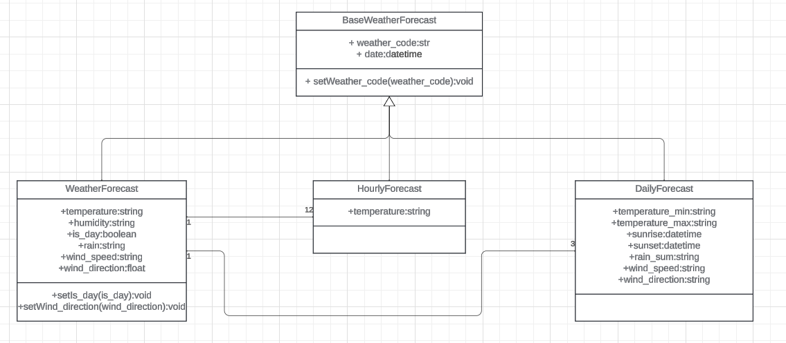

# Weather forecast application

Simple desktop application created with tkinter to check weather: current, hourly, and daily (3 days ahead)

## API we are using

[Open-Meteo](https://open-meteo.com/en/docs)

## Parameters to obtain from API

### Hourly Weather variables

Temperature and Weather code

### Daily Weather variables

Weather code, Maximum Temperature, Minimum Temperature, Sunrise, Sunset, Rain Sum, Maximum Wind Speed and Dominant Wind Direction

### Current Weather variables

Temperature, Is Day or Night, Rain, Weather code, Wind Speed, Wind Direction, Relative Humidity

## Example API request with those parameters

https://api.open-meteo.com/v1/forecast?latitude=52.52&longitude=13.41&current=temperature_2m,relative_humidity_2m,is_day,rain,weather_code,wind_speed_10m,wind_direction_10m&hourly=temperature_2m,weather_code&daily=weather_code,temperature_2m_max,temperature_2m_min,sunrise,sunset,rain_sum,wind_speed_10m_max,wind_direction_10m_dominant&timezone=Europe%2FLondon&forecast_days=3

Response can be found in file [example_response.json](example_response.json)

## Class diagram



## Additional packages needed to run

### [Pillow](https://pypi.org/project/pillow/)

```
python3 -m pip install --upgrade pip
python3 -m pip install --upgrade Pillow
```